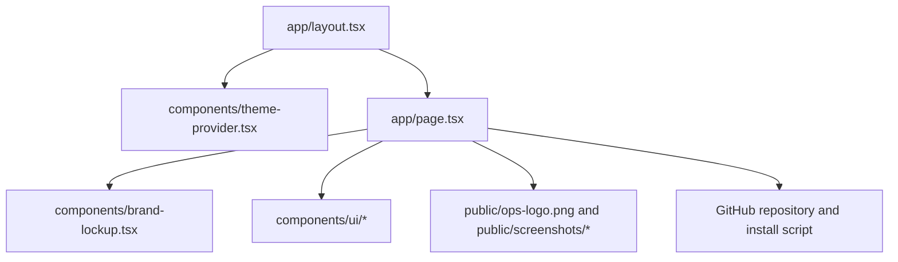

# Ops Landing

> Status: Active

`ops-landing` is the public landing page for Ops, an open-source desktop
operations app for product catalog, inventory, sales, orders, payments, and
analytics.

This repository is intentionally small. It is not the Ops desktop application,
an API service, a backend, a component library, or a monorepo. Its job is to
present the product, show the current product surface, link to the public Ops
repository, and expose the install command.

## Product Context

Ops itself lives next to this repository in `../ops`. That adjacent project is
the Tauri desktop app backed by Supabase. This landing page should stay aligned
with that product, but it should not become the full product documentation.

The current page communicates:

- the Ops desktop workspace value proposition;
- a quick shell install command;
- a link to the public GitHub repository;
- product, inventory, sales, order, and analytics positioning;
- screenshots for the product catalog and analytics surfaces.

## Tech Stack

| Area | Technology |
| --- | --- |
| Framework | Next.js 16 App Router |
| UI runtime | React 19 |
| Language | TypeScript |
| Styling | Tailwind CSS 4, CSS variables, `tw-animate-css` |
| UI primitives | shadcn/radix-nova style components, Radix Slot and Separator |
| Theme handling | `next-themes` |
| Icons | `lucide-react` |
| Package manager | pnpm |

## Runtime Behavior

The app is a static landing page with one client-side interaction:

- `app/page.tsx` is a client component because the install command has a copy
  button that calls `navigator.clipboard.writeText`.
- The page does not define API routes, server actions, database access,
  authentication, authorization, or persistent storage.
- The only external links currently present in the source are the Ops GitHub
  URL and the raw GitHub install script URL.

## Architecture

The implementation is deliberately flat:

```text
ops-landing/
  app/
    layout.tsx      Root metadata, theme provider, and browser translation hints
    page.tsx        Landing page content, install command, screenshots, CTA
    globals.css     Tailwind imports, theme tokens, app colors, scrollbar styles
  components/
    brand-lockup.tsx
    theme-provider.tsx
    ui/             Local shadcn-style primitives used by the page
  lib/
    utils.ts        Shared `cn` helper for class composition
  public/
    ops-logo.png
    screenshots/
      analytics.png
      products.png
  package.json
```



## Key Files

- `app/page.tsx` owns all visible landing-page copy, feature cards, screenshot
  references, the GitHub link, and the `INSTALL_COMMAND` constant.
- `app/layout.tsx` owns the page metadata, favicon references, font setup, theme
  provider, and browser translation protection.
- `app/globals.css` owns the light/dark design tokens and app-level styling.
- `components/ui/*` contains local shadcn-style primitives. They are part of
  this app, not a published design system.
- `public/screenshots/products.png` and `public/screenshots/analytics.png`
  are the product images rendered in the landing page.

## Browser Translation Protection

Browser translation extensions can mutate the DOM and cause hydration or
runtime issues in React applications. This project already includes protection
in `app/layout.tsx`:

- metadata sets `google: "notranslate"`;
- the document body sets `translate="no"`.

Preserve these protections when changing the root layout.

## Setup

### Requirements

- Node.js compatible with Next.js 16.
- pnpm, because this repository has a `pnpm-lock.yaml`.

### Install dependencies

```bash
pnpm install
```

No project-specific environment variables were identified in the current
codebase. There is no `.env.example` in this repository.

## Available Scripts

| Command | Purpose |
| --- | --- |
| `pnpm dev` | Starts the Next.js development server with Turbopack. |
| `pnpm build` | Creates a production Next.js build. |
| `pnpm start` | Starts the production Next.js server after a build. |
| `pnpm lint` | Runs ESLint. |
| `pnpm format` | Formats TypeScript and TSX files with Prettier. |
| `pnpm typecheck` | Runs TypeScript with `tsc --noEmit`. |

There is no test script detected in `package.json`. For validation, use
`pnpm lint` and `pnpm typecheck`.

## Local Development

When running the project locally, use:

```bash
pnpm dev
```

The app renders the single landing page from `app/page.tsx`. The screenshots and
logo are served from `public/`.

## Build And Deployment

This is a standard Next.js app. No provider-specific deployment configuration
was identified in the current codebase:

- no `vercel.json`;
- no Dockerfile or compose file;
- no GitHub Actions workflow;
- no production environment variable contract.

The production build command is:

```bash
pnpm build
```

The production start command is:

```bash
pnpm start
```

TODO: not identified in the current codebase: production host, deployment
provider, rollback process, and release checklist.

## Product Link And Install Command Maintenance

`app/page.tsx` currently defines:

```ts
const INSTALL_COMMAND =
  "curl -fsSL https://raw.githubusercontent.com/polterware/ops/main/install.sh | bash"
const GITHUB_URL = "https://github.com/polterware/ops"
```

The adjacent local Ops checkout uses the remote
`https://github.com/rckbrcls/ops.git`. Treat this as a maintenance checkpoint:
before publishing or changing product copy, confirm whether the public landing
page should still point to `polterware/ops` or to the current repository owner.

## Asset Maintenance

Screenshots are part of the product claim. When Ops changes materially, refresh:

- `public/screenshots/products.png`;
- `public/screenshots/analytics.png`.

Keep the `alt` text in `app/page.tsx` aligned with the image content.

## Security Notes

This repository does not currently handle secrets, user accounts, permissions,
database access, server-side input, or authenticated APIs.

The main operational risk is the shell install command. Keep it accurate and
review the target script before publishing changes that promote installation.

## Known Limitations

- The landing page is intentionally compact and does not include full product
  documentation.
- Product claims can drift from the adjacent `../ops` desktop app if screenshots,
  feature copy, and install links are not reviewed together.
- No automated tests are configured.
- Deployment details are not documented in code or configuration.
- No license file was identified in this repository.

## Documentation Scope

This README is the documentation source for the repository. Separate API,
database, security, setup, deployment, and contributing guides are not present
because the current codebase does not include enough project-specific behavior
to justify them.
